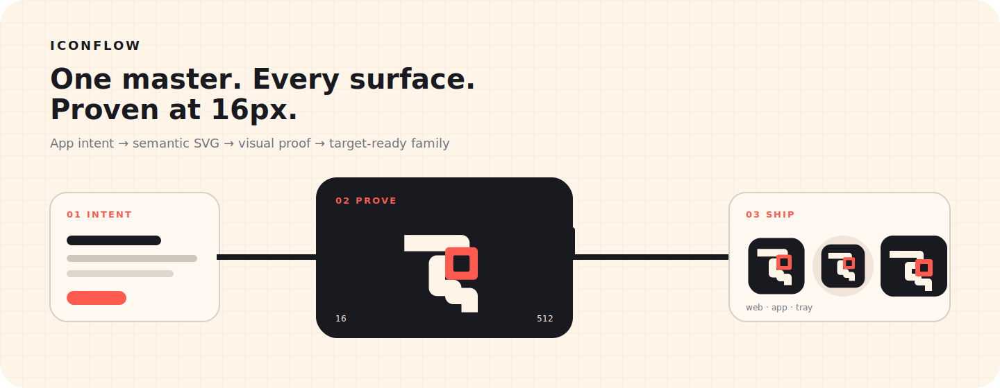
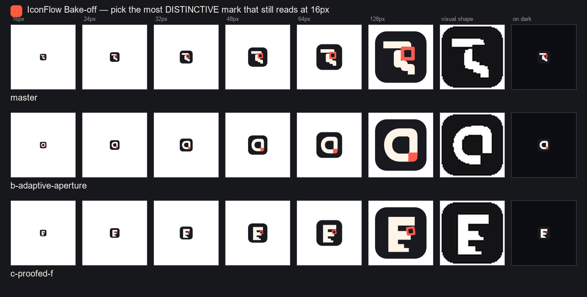
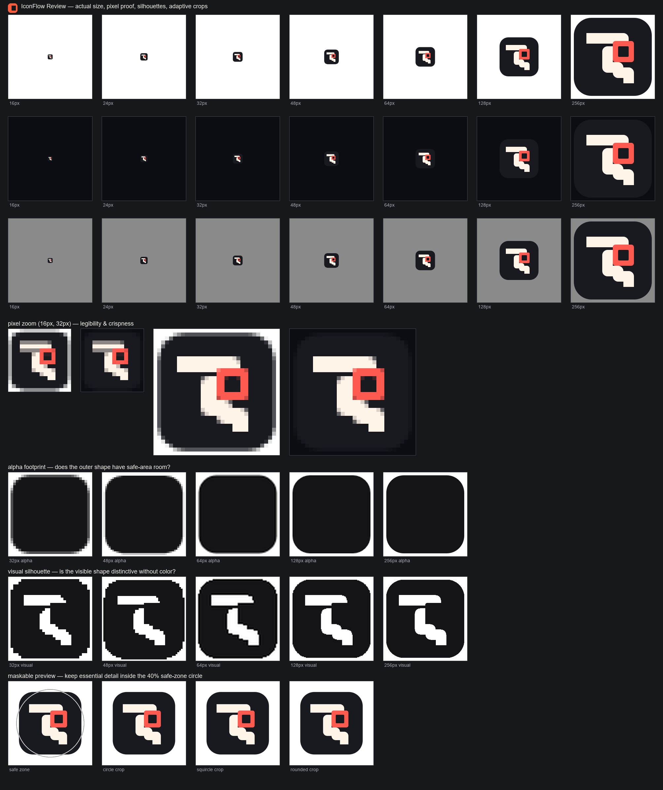

# IconFlow



IconFlow turns an app brief and one semantic SVG source into a **reviewed,
platform-ready icon family**.

It is not a stock-glyph generator or a one-off conversion script. IconFlow
provides the design constraints, browser-accurate rendering, silhouette-driven
bake-off, target previews, hard quality gate, and casebook loop needed to make
an icon specific to what an app actually does—and prove that it still works at
16px before shipping it everywhere.

```text
app intent → distinct concepts → SVG master → 16px proof → target family → casebook
```

## Why IconFlow

Most icon pipelines begin after the important decision has already been made.
They resize an image, but do not tell you whether the idea is generic, whether a
counter closed at 16px, or whether a menu-bar template became a black square.

IconFlow makes those questions part of the build:

| Stage | What IconFlow adds |
|---|---|
| **Intent** | A portable `iconflow.toml` records the user job, essence, personality, palette, clichés, signature device, and targets. |
| **Explore** | A concepting playbook forces 4+ genuinely different lenses and a *specific object* silhouette (distinctiveness = specificity, not a letter on a tile) before SVG work begins. |
| **Compare** | `compare` renders finalists at real sizes plus visual silhouettes, so color cannot hide a generic shape. |
| **Inspect** | `check` catches mechanical risks; `review` produces a contact sheet and a self-contained Review Lab with actual-size, pixel, adaptive-crop, and target previews. |
| **Ship** | `ship` fails closed unless automated QA is clean and all six human rubric scores are at least 4/5. |
| **Learn** | Every shipped design becomes structured casebook evidence; `case stats` reveals recurring weaknesses and house clichés. |

The result is deterministic and fully local. There is no image-model call, API
key, or raster lottery: an agent or designer authors editable SVG, and Chromium
renders exactly what browsers will display.

## Quick start

Python 3.10+ is required. The repository venv is already configured for local
development; a fresh environment needs Playwright Chromium once.

```bash
python -m pip install -e .
python -m iconflow setup
python -m iconflow doctor
```

Create the project brief and build contract first:

```bash
python -m iconflow init \
  --name "My App" \
  --app-intent "turn scattered research into a decision" \
  --user-job "compare evidence without losing context" \
  --essence proof \
  --personality precise --personality calm \
  --cliche sparkle --cliche checkmark \
  --targets web,tauri,electron,tray
```

Then follow the design loop instead of jumping straight to export:

```bash
# Start from a technique family—not a finished stock logo.
python -m iconflow new flat-geometric --out work/my-app/a.svg

# After diverging, compare 2–3 real finalists and LOOK at the sheet.
python -m iconflow compare \
  work/my-app/a.svg work/my-app/b.svg work/my-app/c.svg \
  --out work/my-app/bake.png

# Promote the winner to master.svg, then prove it.
python -m iconflow check master.svg
python -m iconflow review --config iconflow.toml \
  --out work/my-app/review.png \
  --html work/my-app/review.html
```

Read the 16px pixel zoom, visual silhouette, maskable crops, and target previews.
Score the six axes in the Review Lab only after looking, then export its
`master-review.json` receipt. The receipt binds the decision to the current SVG
and tray-source hashes, project name, selected targets, visual build transforms,
automated-warning state, scores, and notes.

The high-level ship command rejects stale/mismatched receipts, re-runs QA, and
refuses incomplete or sub-4 scores:

```bash
python -m iconflow ship --config iconflow.toml \
  --review master-review.json
```

For non-interactive automation, an explicitly `approved` `[review]` table in
`iconflow.toml` with the reviewed `source_sha256` and all six scores ≥4 remains
a supported source-bound fallback.

`build` remains available as a low-level, deterministic exporter when a caller
already owns its quality gate:

```bash
python -m iconflow build master.svg --out ./icon-out \
  --targets web,tauri,electron,tray \
  --name "My App" --theme "#191a20" --bg "#fff4e8" \
  --tray-svg tray.svg
```

Finish by recording the design. This is part of shipping, not optional cleanup:

```bash
python -m iconflow case new --slug my-app \
  --project "My App" --targets web,tauri,electron,tray \
  --essence proof --style flat-geometric \
  --device-family ownable-geometry \
  --device "one app-specific signature device" \
  --concept-lens verb-system \
  --cliche "sparkle / checkmark" \
  --first "legibility=3 distinctiveness=4 balance=4 color=5 scalability=3 craft=4" \
  --final "legibility=4 distinctiveness=4 balance=4 color=5 scalability=4 craft=4" \
  --iterations 2 \
  --lesson "Write one reusable, testable rule from the failed pass."

python -m iconflow case lint
python -m iconflow case stats
```

## The proof is visible

IconFlow's own product identity was designed with the same workflow. Five
concept lenses produced three SVG finalists. The **Flow Gate** winning concept,
expressed as the **Proofed Flow** identity, uses a
continuous master rail, an off-axis square quality gate, and a pixel-step
terminal. It beat a generic adaptive aperture and a conventional F monogram in
the silhouette row.



The winner then went through two review passes. The first tilted gate blurred at
16px; the final gate is aligned to a 64-unit rhythm, with a 128-unit counter that
remains exactly two deliberate pixels at 16px. The editable source, target-aware
Review Lab, dedicated tray mark, gated `iconflow.toml`, and complete build live
in [`brand/`](brand/).

<details>
<summary>Open the final static review sheet</summary>



</details>

Final rubric: legibility 4, distinctiveness 4, balance 4, color 5,
scalability 5, craft 5. `check` is clean.

## Review Lab

`review --html` writes a self-contained artifact with no remote dependencies.
It brings the product brief and the thing being judged into one place:

- real 16–256px actual-size renders plus exact higher-size target transforms,
  on switchable light, dark, gray, and custom surfaces;
- pixel-zoom views that expose anti-aliasing and closed counters;
- alpha footprint and visual silhouette strips;
- adaptive circle, squircle, rounded, and safe-zone crops;
- browser, PWA, Tauri, Electron, tray, and macOS template contexts;
- automated warnings beside the six-axis human rubric;
- a JSON review receipt for a gated workflow.

The static `review.png` remains useful in terminals, PRs, and agent sessions.
The Review Lab is the deeper decision surface—not a decorative gallery.

## What gets built

Targets can be combined; shared sizes render once.

| Target | Key output |
|---|---|
| `web` / `pwa` | `favicon.svg`, multi-frame `favicon.ico`, Apple touch icon, 192/512 and maskable PNGs, manifest, head snippet |
| `tauri` | Tauri desktop `icons/` PNG ladder plus multi-size ICO and ICNS |
| `electron` | `build/icon.png`, `.ico`, and `.icns`, with the same corner transform applied to native frames |
| `tray` | Windows color 16/32px icons, macOS monochrome template pair, optional TypeScript data URL module |

Web builds also support relative/static-site paths, richer manifest metadata,
Windows tiles, custom manifest keys, and additional head metadata. See
[`docs/OUTPUT_TARGETS.md`](docs/OUTPUT_TARGETS.md) for exact file sets.

For products with a full-card app icon, provide a semantic mark-only tray SVG
or stable foreground groups. IconFlow's template conversion can separate a
contrasting mark from a card, but an explicit tray source is the strongest
contract. [`brand/tray.svg`](brand/tray.svg) demonstrates the pattern.

## Technique scaffolds, not stock logos

`new` offers four execution families:

- `gradient-glow` — restrained inner light clipped to one semantic shape;
- `flat-geometric` — solid geometry, one accent, and deliberate negative space;
- `line-mark` — one weight, transparent surface, contrast-aware outline;
- `mascot` — soft-form/character construction without prescribing a specific animal.

Each preset now renders IconFlow's house structure only to demonstrate the
technique. Every file explicitly tells the designer to replace the geometry with
the consuming app's user job and one signature device. All four pass `check`
cleanly; none is intended to ship unchanged.

## The casebook closes the loop

Each case stores the brief, concept lens, device family/detail, clichés avoided,
first and final rubric scores, review count, and reusable lessons. Aggregation
answers design-system questions that a directory of PNGs cannot:

- Which axis is repeatedly weak on the first pass?
- Is one signature-device family becoming IconFlow's own cliché?
- Are projects improving by the final review?
- Which lessons have not yet been distilled into the playbook or code?

```bash
python -m iconflow case list
python -m iconflow case lint --strict
python -m iconflow case stats
python -m iconflow case atlas --out case-atlas.html
```

The protocol is documented in [`docs/EVOLUTION.md`](docs/EVOLUTION.md). Raw
experience lives in `casebook/`; distilled rules live in `docs/LEARNINGS.md`;
mechanically enforceable lessons belong in the engine and its tests.

## Repository map

```text
brand/                      IconFlow's own master, tray source, review, and outputs
casebook/                   structured evidence from shipped icons
docs/
  DESIGN_PLAYBOOK.md        geometry, color, 16px discipline, critique loop
  CONCEPTING.md             divergence, cliché filter, signature devices, bake-off
  REVIEW_CHECKLIST.md       six-axis shipping rubric
  SVG_TECHNIQUES.md         browser-tested SVG construction patterns
  OUTPUT_TARGETS.md         exact platform asset contracts
  WORKFLOW.md               config → receipt → gated ship contract
  LEARNINGS.md              distilled rules from shipped cases
  EVOLUTION.md              record → measure → distill protocol
examples/                   end-to-end usage patterns
iconflow/                   renderer, QA, review, packaging, config, and CLI
templates/presets/          check-clean technique scaffolds
work/                       gitignored design-session evidence
AGENTS.md                   required procedure for agent designers
```

## The Claude Code `/iconflow` skill

Claude Code users get a `/iconflow` skill whose canonical source lives in this
repo at [`skills/iconflow/`](skills/iconflow/). It versions with the toolkit, so
it never drifts from the procedure in `AGENTS.md`. `scripts/setup.ps1` installs
it into `~/.claude/skills/iconflow/`; see that directory's README to reinstall
or edit it.

## Calling IconFlow from another project

Install this repository once into the toolkit venv:

```powershell
path\to\ai-iconflow\.venv\Scripts\python.exe -m pip install -e path\to\ai-iconflow
```

Then invoke the module from the consuming repository and keep its editable
`master.svg`, `iconflow.toml`, and case record with that project.

For a Windows shortcut that launches PowerShell, use the high-level helper; it
handles nested quoting and verifies CJK paths by reading the `.lnk` back:

```bash
python -m iconflow shortcut \
  --powershell-script "D:\app\launch.ps1" \
  --icon "D:\app\icon-out\build\icon.ico" \
  --workdir "D:\app" --name "My App" \
  --out desktop --verify
```

## Development

```bash
python -m iconflow doctor
python -m unittest discover -s tests
```

The engine uses `playwright` and `Pillow`; no external service or API key is
required. Runtime rendering is network-isolated, JavaScript-disabled,
animation-frozen, and deterministic. The Python package remains named
`ai-iconflow` for compatibility, while the product and CLI are simply
**IconFlow**.

## Contributing

See [`CONTRIBUTING.md`](CONTRIBUTING.md) for the design/evolution loop, how to run
the checks, and the case-recording protocol that keeps the system improving.

## License

Not yet licensed — all rights reserved for now. A license will be chosen before
wider distribution; until then, please open an issue before reusing the code or
docs in your own project.
