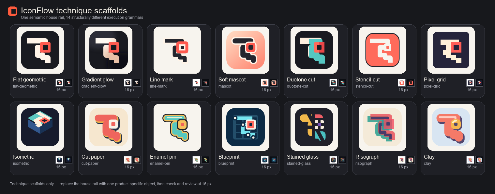

<div align="center">

# IconFlow

**One reviewed, platform-ready icon family from one editable SVG.**<br>
Favicon, PWA, Tauri, Electron, and tray — proven at 16px before it ships anywhere.

[](https://pypi.org/project/iconflow/)
[](https://pypi.org/project/iconflow/)
[](https://github.com/snowyukitty/ai-iconflow/actions/workflows/ci.yml)
[](LICENSES.md)
[](LICENSES.md#1-the-icons-you-make-with-iconflow-are-yours)

[**Live proof**](https://ai-iconflow.com/) ·
[Remix Lab](https://ai-iconflow.com/#remix) ·
[137-direction Archive](https://ai-iconflow.com/archive/) ·
[100-case Gallery](https://ai-iconflow.com/gallery/) ·
[400-cell Matrix](https://ai-iconflow.com/gallery/emoji-matrix/all/) ·
[How it's made](https://ai-iconflow.com/how-icons-are-made/)

</div>


```bash
pip install iconflow          # or: uv tool install iconflow
iconflow setup                # fetches Chromium — the only network step
iconflow demo --out demo      # doctor → check → review → ship, on a real receipt
```

**No image model. No API key. No upload.** You author the SVG, a pinned Chromium
renders it exactly as a browser would, and `ship` fails closed unless automated
QA is clean and all six human rubric scores are at least 4/5.

**The icons you make with it are yours** — no attribution, no share-alike,
commercial use unrestricted. Run `iconflow license` for the whole answer.

```text
app intent → distinct concepts → SVG master → 16px proof → target family → casebook
```

The site reads in five languages — English, [Español](https://ai-iconflow.com/es/), [日本語](https://ai-iconflow.com/ja/), [繁體中文](https://ai-iconflow.com/zh-hant/), [简体中文](https://ai-iconflow.com/zh-hans/). The toolkit and its documentation stay English.

IconFlow is a local design-and-release workflow for agents, designers, and
small product teams. It is not a stock-glyph generator or a one-off conversion
script: it provides the design constraints, browser-faithful rendering,
silhouette-driven bake-off, target previews, hard quality gate, and casebook
loop needed to make an icon specific to what an app actually does — and prove
that it still works at 16px before shipping it everywhere.

Twenty structurally different technique scaffolds help designers choose an
execution language without pretending a stock shape is a finished identity:



The same packaged sources generate this proof locally with
`iconflow styles --gallery style-gallery.png`; see the
[style catalog](docs/STYLE_CATALOG.md) for selection rules, tray strategies, and
clean-room research provenance.

## Why IconFlow

Most icon pipelines begin after the important decision has already been made.
They resize an image, but do not tell you whether the idea is generic, whether a
counter closed at 16px, or whether a menu-bar template became a black square.

IconFlow makes those questions part of the build:

| Stage | What IconFlow adds |
|---|---|
| **Intent** | A portable `iconflow.toml` records the user job, essence, personality, palette, clichés, signature device, and targets. |
| **Explore** | A concepting playbook forces 4+ genuinely different lenses and a *specific object* silhouette (distinctiveness = specificity, not a letter on a tile) before SVG work begins. |
| **Compare** | `compare` renders finalists at real sizes plus visual silhouettes, so color cannot hide a generic shape. |
| **Inspect** | `check` catches mechanical risks; `review` produces a contact sheet and a self-contained Review Lab with actual-size, pixel, adaptive-crop, and target previews. |
| **Ship** | `ship` fails closed unless automated QA is clean and all six human rubric scores are at least 4/5. |
| **Learn** | Every shipped design becomes structured casebook evidence; `case stats` reveals recurring weaknesses and house clichés. |

The working path is local after dependencies and Chromium are installed. There
is no image-model call or API key: an agent or designer authors editable SVG,
and a pinned toolchain renders repeatable target assets without network access.
Unlike a generic favicon converter, IconFlow starts before conversion—with the
product job and competing concepts—and refuses to ship unreviewed pixels.

## Five-minute proof

Python 3.10+ is required. The one-time `setup` step downloads Playwright
Chromium; everything after it is local.

```bash
pip install iconflow          # or: uv tool install iconflow / pipx install iconflow
iconflow setup                # fetches Chromium — the only network step
iconflow doctor               # proves the environment
iconflow demo --out iconflow-demo
```

`demo` copies a real, already-reviewed family into that directory and runs
`doctor` → `check` → `review` → `ship` against its source-bound receipt, so your
first success is a genuine gated ship rather than a render. Edit the copied
`master.svg` and re-run `ship` to watch it refuse the stale receipt.

Working from a checkout instead — contributors, or anyone who wants the brand
sources — no activation is required:

```bash
git clone https://github.com/snowyukitty/ai-iconflow.git
cd ai-iconflow
python -m venv .venv
```

```powershell
# Windows PowerShell
powershell -NoProfile -ExecutionPolicy Bypass -File .\scripts\setup.ps1
.venv\Scripts\python.exe -m iconflow doctor
.venv\Scripts\python.exe -m iconflow ship `
  --config brand/iconflow.toml --review brand/master-review.json `
  --out work/quick-start/icon-out
```

```bash
# macOS / Linux
sh ./scripts/setup.sh
.venv/bin/python -m iconflow doctor
.venv/bin/python -m iconflow ship \
  --config brand/iconflow.toml --review brand/master-review.json \
  --out work/quick-start/icon-out
```

That last command re-validates IconFlow's checked-in, source-bound review
receipt and builds 23 web, Tauri desktop, Electron, and tray files. It is a
reproducible engine proof, not a claim that a distinctive new identity can be
designed in five minutes.

The same proof is packaged as one command, `iconflow demo --out iconflow-demo`
(`.venv\Scripts\python.exe -m iconflow demo ...` from this checkout; it is not on
PyPI yet). It copies the reviewed brand family — `master.svg`, `tray.svg`,
`iconflow.toml`, `master-review.json` — into that directory and runs `doctor` →
`check` → `review` (sheet + Review Lab) → `ship` against the bundled receipt; add
`--setup` to install Chromium first and `--json` for the machine-readable result.
Edit the copied `master.svg` and re-run `ship` to watch it refuse the stale receipt.

## Design and ship your own icon

Create the project brief and build contract first:

```bash
python -m iconflow init \
  --name "My App" \
  --app-intent "turn scattered research into a decision" \
  --user-job "compare evidence without losing context" \
  --essence proof \
  --personality precise --personality calm \
  --cliche sparkle --cliche checkmark \
  --targets web,tauri,electron,tray
```

Then follow the design loop instead of jumping straight to export:

```bash
# Start from a technique family—not a finished stock logo.
python -m iconflow new flat-geometric --out work/my-app/a.svg

# After diverging, compare 2–3 real finalists and LOOK at the sheet.
python -m iconflow compare \
  work/my-app/a.svg work/my-app/b.svg work/my-app/c.svg \
  --out work/my-app/bake.png

# Promote the winner to master.svg, then prove it.
python -m iconflow check master.svg
python -m iconflow check master.svg --tray-svg tray.svg   # + macOS template audit
python -m iconflow review --config iconflow.toml \
  --out work/my-app/review.png \
  --html work/my-app/review.html
```

Read the 16px pixel zoom, visual silhouette, maskable crops, and target previews.
Score the six axes in the Review Lab only after looking, then export its
`master-review.json` receipt. The receipt binds the decision to the current SVG
and tray-source hashes, project name, selected targets, visual build transforms,
automated-warning state, scores, and notes.

The high-level ship command rejects stale/mismatched receipts, re-runs QA, and
refuses incomplete or sub-4 scores:

```bash
python -m iconflow ship --config iconflow.toml \
  --review master-review.json
```

For non-interactive automation, an explicitly `approved` `[review]` table in
`iconflow.toml` with the reviewed `source_sha256`, full `contract_sha256`, and
all six scores ≥4 remains a supported fallback. Any source, project, target,
color, Electron, color-scheme, tray-mode, or tray-source change invalidates it.

`build` remains available as a low-level, deterministic exporter when a caller
already owns its quality gate:

```bash
python -m iconflow build master.svg --out ./icon-out \
  --targets web,tauri,electron,tray \
  --name "My App" --theme "#191a20" --bg "#fff4e8" \
  --tray-svg tray.svg
```

Finish by recording the design. This is part of shipping, not optional cleanup:

```bash
python -m iconflow case new --slug my-app \
  --project "My App" --targets web,tauri,electron,tray \
  --essence proof --style flat-geometric \
  --device-family ownable-geometry \
  --device "one app-specific signature device" \
  --concept-lens verb-system \
  --cliche "sparkle / checkmark" \
  --first "legibility=3 distinctiveness=4 balance=4 color=5 scalability=3 craft=4" \
  --final "legibility=4 distinctiveness=4 balance=4 color=5 scalability=4 craft=4" \
  --iterations 2 \
  --lesson "Write one reusable, testable rule from the failed pass."

python -m iconflow case lint
python -m iconflow case stats
```

## The proof is visible

IconFlow currently uses **Petal Haypile** as an explicitly temporary product
mark while the permanent identity decision remains open. The owner selected it
from the Round 3 living exploration: a low-eared pika returns to its hay store
with three oversized petals. Its editable master, linked tray source,
source-bound receipt, and checked-in target build live in [`brand/`](brand/).

Petal Haypile came out of a 28-direction living exploration. The bake-off
sheet below places it beside the four Round 3 finalists that also passed the
full target gate, at every native size, in silhouette, and on dark:


Its review sheet is the same artifact every consuming project gets from
`iconflow review`: actual-size renders on three surfaces, pixel zoom, alpha
footprint, visual silhouette, and adaptive crops. The case is preserved in
[`casebook/2026-08-14-iconflow-petal-haypile-temporary.md`](casebook/2026-08-14-iconflow-petal-haypile-temporary.md).


Current Petal Haypile rubric: legibility 4, distinctiveness 5, balance 4,
color 5, scalability 4, craft 4, `check` clean. The earlier **Flow Gate /
Proofed Flow** identity remains historical evidence and the fixed specimen used
for controlled technique comparisons; its case is
[`casebook/2026-07-13-iconflow-brand.md`](casebook/2026-07-13-iconflow-brand.md)
(historical rubric: legibility 4, distinctiveness 4, balance 4, color 5,
scalability 5, craft 5).

## Review Lab

`review --html` writes a self-contained artifact with no remote dependencies.
It brings the product brief and the thing being judged into one place:

- real 16–256px actual-size renders plus exact higher-size target transforms,
  on switchable light, dark, gray, and custom surfaces;
- pixel-zoom views that expose anti-aliasing and closed counters;
- alpha footprint and visual silhouette strips;
- adaptive circle, squircle, rounded, and safe-zone crops;
- browser, PWA, Tauri, Electron, tray, and macOS template contexts;
- automated warnings beside the six-axis human rubric;
- a JSON review receipt for a gated workflow.

The static `review.png` remains useful in terminals, PRs, and agent sessions.
The Review Lab is the deeper decision surface—not a decorative gallery.

## What gets built

Targets can be combined; shared sizes render once.

| Target | Key output |
|---|---|
| `web` / `pwa` | `favicon.svg`, multi-frame `favicon.ico`, Apple touch icon, 192/512 and maskable PNGs, manifest, head snippet |
| `tauri` | Tauri desktop `icons/` PNG ladder plus multi-size ICO and ICNS |
| `electron` | `build/icon.png`, `.ico`, and `.icns`, with the same corner transform applied to native frames |
| `tray` | Color 16/32px PNGs, macOS monochrome template pair, optional TypeScript data URL module |

Web builds also support relative/static-site paths, richer manifest metadata,
Windows tiles, custom manifest keys, and additional head metadata. See
[`docs/OUTPUT_TARGETS.md`](docs/OUTPUT_TARGETS.md) for exact file sets.

For products with a full-card app icon, provide a semantic mark-only tray SVG
or stable foreground groups. IconFlow's template conversion can separate a
contrasting mark from a card, but an explicit tray source is the strongest
contract. [`brand/tray.svg`](brand/tray.svg) demonstrates the pattern.

## Technique scaffolds, not stock logos

`new` offers twenty execution families. Discover them from an installed wheel
instead of memorizing a list:

```bash
iconflow styles
iconflow styles --gallery style-gallery.png
iconflow new cut-paper --out work/my-app/cut-paper.svg
```

The families span flat geometry, glow, uniform line, mascot, duotone plane,
stencil, pixel, isometric, cut paper, enamel, blueprint, stained glass,
risograph, clay, cel shading, chrome, ink brush, woodcut, glass stacking, and
weaving. Each has its own structural model, 16px rule, and
tray/monochrome strategy in [`docs/STYLE_CATALOG.md`](docs/STYLE_CATALOG.md).

Each preset renders IconFlow's house structure only to demonstrate the
technique. Every file explicitly tells the designer to replace the geometry with
the consuming app's user job and one signature device. All twenty pass `check`
cleanly; none is intended to ship unchanged. `new` preserves an existing output
unless replacement is explicit with `--force`.

## The casebook closes the loop

Each case stores the brief, concept lens, device family/detail, clichés avoided,
first and final rubric scores, review count, and reusable lessons. Aggregation
answers design-system questions that a directory of PNGs cannot:

- Which axis is repeatedly weak on the first pass?
- Is one signature-device family becoming IconFlow's own cliché?
- Are projects improving by the final review?
- Which lessons have not yet been distilled into the playbook or code?

```bash
python -m iconflow case list
python -m iconflow case lint --strict
python -m iconflow case stats
python -m iconflow case atlas --out case-atlas.html
```

The protocol is documented in [`docs/EVOLUTION.md`](docs/EVOLUTION.md). Raw
experience lives in `casebook/`; distilled rules live in `docs/LEARNINGS.md`;
mechanically enforceable lessons belong in the engine and its tests.

## Repository map

```text
brand/                      IconFlow's own master, tray source, review, and outputs
showcase/                   approved cross-theme masters, receipts, and web builds
website/                    static Cloudflare Pages launch site and reviewed assets
  i18n/                     translation catalogs and the binding glossary (5 languages)
website-redirect/           permanent compatibility redirect for the former host
casebook/                   structured evidence from shipped icons
docs/
  DESIGN_PLAYBOOK.md        geometry, color, 16px discipline, critique loop
  STYLE_CATALOG.md          20 technique families, selection, provenance
  LAUNCH_SITE.md            promotional-site narrative and acceptance contract
  PROMO_VIDEO.md            evidence-led film production contract
  promo/                    source-bound HyperFrames 60/30/15 storyboards
  SHOWCASE_PLAN.md          cross-theme icon production queue
  CONCEPTING.md             divergence, cliché filter, signature devices, bake-off
  REVIEW_CHECKLIST.md       six-axis shipping rubric
  SVG_TECHNIQUES.md         browser-tested SVG construction patterns
  OUTPUT_TARGETS.md         exact platform asset contracts
  WORKFLOW.md               config → receipt → gated ship contract
  LEARNINGS.md              distilled rules from shipped cases
  EVOLUTION.md              record → measure → distill protocol
examples/                   end-to-end usage patterns
iconflow/                   renderer, QA, review, packaging, config, and CLI
templates/presets/          check-clean technique scaffolds
skills/                     the agent front door — installed by `iconflow skill install`
  iconflow/                 canonical open Agent Skill + Codex client metadata
  commands/                 /iconflow:icon and /iconflow:setup slash commands
  .claude-plugin/           Claude Code plugin manifest
.claude-plugin/             marketplace catalog for `/plugin marketplace add`
work/                       gitignored design-session evidence
AGENTS.md                   required procedure for agent designers
LICENSES.md                 the tier map: your output, tool, method, works
licenses/                   full CC0 / CC BY / CC BY-SA / CC BY-NC-ND texts
```

## Use IconFlow from your AI agent

IconFlow is built to be handed to an agent. The design procedure, the reference
documents it cites, and the gates that stop a generic mark from shipping all
travel with the package — so a session in *your* repository follows the same
rules this one does, without cloning anything.

**Claude Code — two commands.** The plugin carries the skill plus the
`/iconflow:icon` and `/iconflow:setup` slash commands:

```
/plugin marketplace add snowyukitty/ai-iconflow
/plugin install iconflow@iconflow
```

Then just ask for an icon, or run `/iconflow:icon a tool that turns scattered
research into a decision`. The agent installs the toolkit itself the first time.

**Codex, Copilot, and other open Agent Skills clients — one command.** From any
install of the package:

```bash
iconflow skill install
```

That deploys `SKILL.md` from the installed wheel into `~/.agents/skills/`,
`~/.claude/skills/`, and `~/.copilot/skills/`, and removes the superseded
`~/.codex/skills/iconflow/` copy (current Codex scans both user roots and does
not merge same-named skills, so keeping it would show a duplicate). Add
`--project` to install into the current repository instead, or `--dir` to name a
location. Automatic discovery remains client-dependent.

**Any other agent.** `iconflow skill print` writes the whole procedure to
stdout, `iconflow docs` lists every reference document, and
`iconflow docs CONCEPTING` prints one. Nothing requires a checkout:

```bash
iconflow docs                        # what is available
iconflow docs DESIGN_PLAYBOOK        # read one
iconflow docs --out ./iconflow-docs  # export the set
```

The canonical skill source is [`skills/iconflow/SKILL.md`](skills/iconflow/SKILL.md)
with Codex interface metadata in
[`skills/iconflow/agents/openai.yaml`](skills/iconflow/agents/openai.yaml) and
the Claude Code plugin manifest in `skills/.claude-plugin/plugin.json`. All
three version with the toolkit, and `iconflow skill install` is the single code
path the setup scripts use too, so a deployed copy cannot drift from the
source. Edit the canonical file and rerun the installer; never hand-edit a
deployed copy.

Agents that prefer a machine surface get the `--json` envelopes and the 0/1/2
exit codes in [`docs/AGENT_CONTRACT.md`](docs/AGENT_CONTRACT.md), and can prove
the whole engine in one command with `iconflow demo --out iconflow-demo`.

## Calling IconFlow from another project

Install this repository once into the toolkit venv:

```powershell
path\to\iconflow\.venv\Scripts\python.exe -m pip install -e path\to\iconflow
```

Then invoke the module from the consuming repository and keep its editable
`master.svg`, `iconflow.toml`, and case record with that project.

For a Windows shortcut that launches PowerShell, use the high-level helper; it
handles nested quoting and verifies CJK paths by reading the `.lnk` back:

```bash
python -m iconflow shortcut \
  --powershell-script "D:\app\launch.ps1" \
  --icon "D:\app\icon-out\build\icon.ico" \
  --workdir "D:\app" --name "My App" \
  --out desktop --content-address-icon
```

The content-addressed mode installs a SHA-256-named icon alias and implies
`--verify`, so changed icon bytes also change the shortcut's `IconLocation`
instead of relying on Explorer cache invalidation.

## Development

```bash
python -m pip install -e ".[dev]"
python -m iconflow doctor
python -m unittest discover -s tests
python -m iconflow case lint
python -m build
python scripts/verify_distribution.py dist/*
```

The engine uses `playwright` and `Pillow`; no external service or API key is
required. Runtime rendering validates bounded SVG/XML, blocks network and file
resources, disables JavaScript and service workers, and freezes animation. See
[`SECURITY.md`](SECURITY.md) for the reporting process and
[`THIRD_PARTY_NOTICES.md`](THIRD_PARTY_NOTICES.md) for dependency and asset
provenance. The package, the CLI, the agent skill, and the product are all
called **`iconflow`** — one name, so `pip install iconflow` gives you an
`iconflow` command.

## Limits and reproducibility

- Installation and `iconflow setup` need network access; rendering and builds
  do not.
- Byte-for-byte determinism is scoped to the same normalized SVG, config, and
  Chromium/Pillow/IconFlow toolchain. Upgrade those components deliberately and
  review the resulting pixels.
- Tauri output currently covers desktop assets, not Android or iOS launch/icon
  sets. Tray template extraction is strongest with a dedicated mark-only SVG.
- IconFlow validates and rasterizes SVG; it is not a general-purpose sanitizer
  for republishing arbitrary source SVG on the web.
- Wheel builds are reproducible when `SOURCE_DATE_EPOCH` is fixed. Current
  setuptools sdists have identical file contents across local rebuilds but may
  differ at the archive level because generated member timestamps vary.

## Contributing

See [`CONTRIBUTING.md`](CONTRIBUTING.md) for the design/evolution loop, how to run
the checks, and the case-recording protocol that keeps the system improving.
Release preparation is tracked in
[`docs/LAUNCH_READINESS.md`](docs/LAUNCH_READINESS.md).

## License

### The icons you make with IconFlow are yours

No attribution, no share-alike, no commercial restriction. Ship them, sell them,
trademark them. The technique scaffolds behind `iconflow new` are **CC0 public
domain** precisely so that a mark you evolve from one inherits nothing, and
applying the published method creates no obligation either — copyright covers
the playbook's wording, not the design rules it describes.

Run `iconflow license` any time for the authoritative summary, or
`iconflow license --json` if you are an agent that needs to quote it exactly.

### The repository is not under a single license

[`LICENSES.md`](LICENSES.md) is the map; each tiered directory carries its own
`LICENSE`, and full texts live in [`licenses/`](licenses/).

| What | Where | License |
|---|---|---|
| **Your output** | anything you design with IconFlow | **yours, no conditions** |
| The tool | `iconflow/`, `scripts/`, `tests/`, site code | [`Apache-2.0`](LICENSE) |
| Starting points | `templates/` scaffolds, files written into your project | `CC0-1.0` |
| The methodology | `docs/`, `casebook/`, `skills/` | `CC-BY-SA-4.0` |
| Brand & packaged imagery | `brand/`, `demo/`, `docs/assets/` | `CC-BY-4.0` + [trademark](TRADEMARKS.md) |
| The published corpus | `gallery/`, `showcase/`, `examples/`, `website/assets/` | `CC-BY-NC-ND-4.0` |

GitHub's sidebar shows "Apache-2.0" because that is what the root `LICENSE`
file says; it is reporting the tool tier. The written methodology stays open but
carries ShareAlike, so a work reusing that prose must credit IconFlow and stay
open too. The 137 Living Archive studies and the rest of IconFlow's finished
artwork are published as evidence, not as a free icon pack.

One thing IconFlow deliberately copies out is its **own** identity:
`iconflow demo` materializes the Petal Haypile family to prove the engine
against a real receipt, and writes a `LICENSE-NOTICE.md` beside it saying so. To
start your own design, use `iconflow init` and `iconflow new <preset>`.

The engine being Apache-2.0 means a modified fork inside a closed product is
permitted — that is the deal, and it is what makes the tool safe to adopt. What
a redistributor still owes is attribution: Apache-2.0 §4 requires them to keep
the license, keep the per-file notices, state that they changed files, and carry
`NOTICE`. Every source file carries an SPDX header so that obligation travels
with the code rather than only with the repository.
[`docs/PROVENANCE.md`](docs/PROVENANCE.md) records what that looks like when it
is honoured and when it is not.

Contributions need a DCO sign-off and a signature on [`CLA.md`](CLA.md). You keep
your copyright; the CLA is a license, not an assignment, and its purpose is
stated openly in its §6.

Attribution lives in [`NOTICE`](NOTICE); dependency provenance in
[`THIRD_PARTY_NOTICES.md`](THIRD_PARTY_NOTICES.md).

No license here grants permission to use the IconFlow name, logo, or official
project identity to brand or endorse a modified distribution, product, or
service. Truthful references and compatibility statements remain welcome; see
the [IconFlow trademark policy](TRADEMARKS.md) for the precise boundary.
