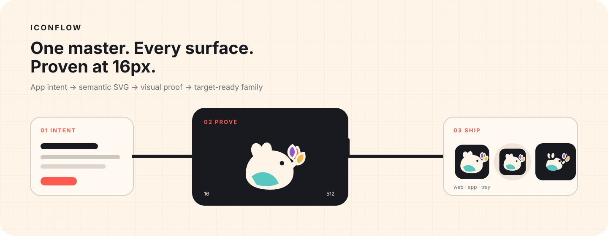
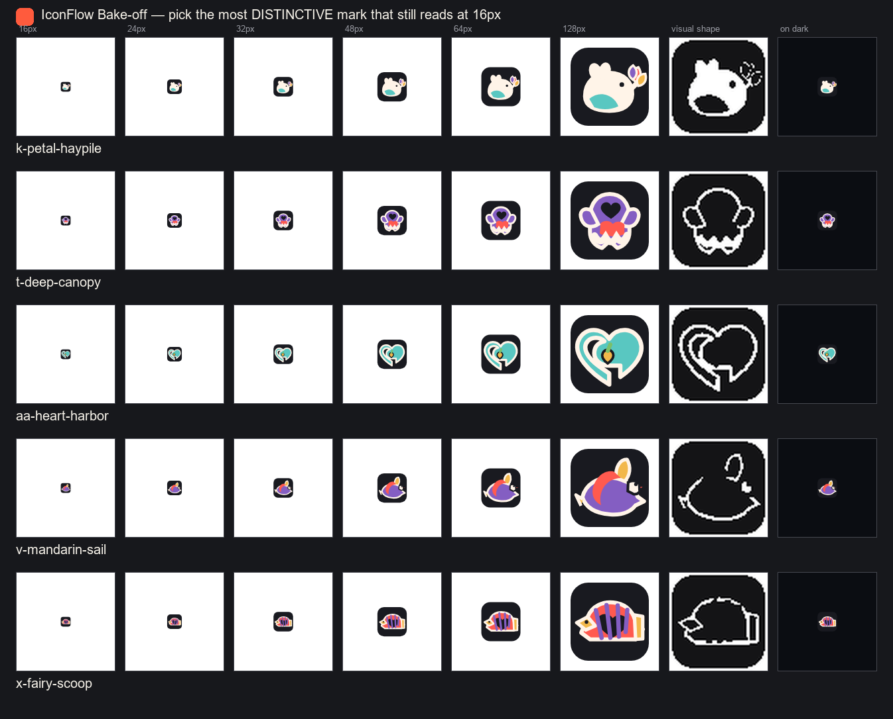
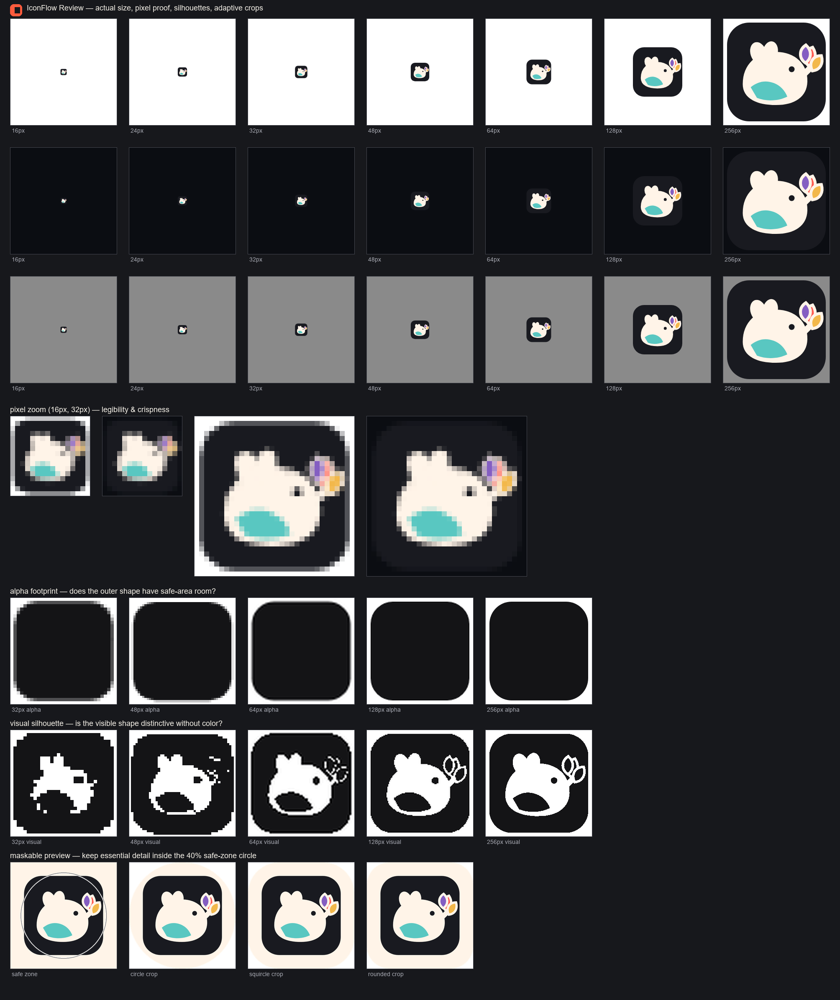

# IconFlow



IconFlow is a local design-and-release workflow for agents, designers, and
small product teams that need one **reviewed, platform-ready icon family** from
an editable semantic SVG.

It is not a stock-glyph generator or a one-off conversion script. IconFlow
provides the design constraints, browser-faithful Chromium rendering, silhouette-driven
bake-off, target previews, hard quality gate, and casebook loop needed to make
an icon specific to what an app actually does—and prove that it still works at
16px before shipping it everywhere.

```text
app intent → distinct concepts → SVG master → 16px proof → target family → casebook
```

## Why IconFlow

Most icon pipelines begin after the important decision has already been made.
They resize an image, but do not tell you whether the idea is generic, whether a
counter closed at 16px, or whether a menu-bar template became a black square.

IconFlow makes those questions part of the build:

| Stage | What IconFlow adds |
|---|---|
| **Intent** | A portable `iconflow.toml` records the user job, essence, personality, palette, clichés, signature device, and targets. |
| **Explore** | A concepting playbook forces 4+ genuinely different lenses and a *specific object* silhouette (distinctiveness = specificity, not a letter on a tile) before SVG work begins. |
| **Compare** | `compare` renders finalists at real sizes plus visual silhouettes, so color cannot hide a generic shape. |
| **Inspect** | `check` catches mechanical risks; `review` produces a contact sheet and a self-contained Review Lab with actual-size, pixel, adaptive-crop, and target previews. |
| **Ship** | `ship` fails closed unless automated QA is clean and all six human rubric scores are at least 4/5. |
| **Learn** | Every shipped design becomes structured casebook evidence; `case stats` reveals recurring weaknesses and house clichés. |

The working path is local after dependencies and Chromium are installed. There
is no image-model call or API key: an agent or designer authors editable SVG,
and a pinned toolchain renders repeatable target assets without network access.
Unlike a generic favicon converter, IconFlow starts before conversion—with the
product job and competing concepts—and refuses to ship unreviewed pixels.

## Five-minute proof

Python 3.10+ is required. IconFlow is not published on PyPI yet, so install the
current source checkout; do not use `pip install ai-iconflow` until a release is
listed on the [official PyPI project page](https://pypi.org/project/ai-iconflow/).
The one-time `setup` step downloads Playwright Chromium.

```bash
git clone https://github.com/snowyukitty/ai-iconflow.git
cd ai-iconflow
python -m venv .venv
```

Then use the venv interpreter directly—no activation is required:

```powershell
# Windows PowerShell
.venv\Scripts\python.exe -m pip install .
.venv\Scripts\python.exe -m iconflow setup
.venv\Scripts\python.exe -m iconflow doctor
.venv\Scripts\python.exe -m iconflow ship `
  --config brand/iconflow.toml --review brand/master-review.json `
  --out work/quick-start/icon-out
```

```bash
# macOS / Linux
.venv/bin/python -m pip install .
.venv/bin/python -m iconflow setup
.venv/bin/python -m iconflow doctor
.venv/bin/python -m iconflow ship \
  --config brand/iconflow.toml --review brand/master-review.json \
  --out work/quick-start/icon-out
```

That last command re-validates IconFlow's checked-in, source-bound review
receipt and builds 23 web, Tauri desktop, Electron, and tray files. It is a
reproducible engine proof, not a claim that a distinctive new identity can be
designed in five minutes.

## Design and ship your own icon

Create the project brief and build contract first:

```bash
python -m iconflow init \
  --name "My App" \
  --app-intent "turn scattered research into a decision" \
  --user-job "compare evidence without losing context" \
  --essence proof \
  --personality precise --personality calm \
  --cliche sparkle --cliche checkmark \
  --targets web,tauri,electron,tray
```

Then follow the design loop instead of jumping straight to export:

```bash
# Start from a technique family—not a finished stock logo.
python -m iconflow new flat-geometric --out work/my-app/a.svg

# After diverging, compare 2–3 real finalists and LOOK at the sheet.
python -m iconflow compare \
  work/my-app/a.svg work/my-app/b.svg work/my-app/c.svg \
  --out work/my-app/bake.png

# Promote the winner to master.svg, then prove it.
python -m iconflow check master.svg
python -m iconflow review --config iconflow.toml \
  --out work/my-app/review.png \
  --html work/my-app/review.html
```

Read the 16px pixel zoom, visual silhouette, maskable crops, and target previews.
Score the six axes in the Review Lab only after looking, then export its
`master-review.json` receipt. The receipt binds the decision to the current SVG
and tray-source hashes, project name, selected targets, visual build transforms,
automated-warning state, scores, and notes.

The high-level ship command rejects stale/mismatched receipts, re-runs QA, and
refuses incomplete or sub-4 scores:

```bash
python -m iconflow ship --config iconflow.toml \
  --review master-review.json
```

For non-interactive automation, an explicitly `approved` `[review]` table in
`iconflow.toml` with the reviewed `source_sha256`, full `contract_sha256`, and
all six scores ≥4 remains a supported fallback. Any source, project, target,
color, Electron, color-scheme, tray-mode, or tray-source change invalidates it.

`build` remains available as a low-level, deterministic exporter when a caller
already owns its quality gate:

```bash
python -m iconflow build master.svg --out ./icon-out \
  --targets web,tauri,electron,tray \
  --name "My App" --theme "#191a20" --bg "#fff4e8" \
  --tray-svg tray.svg
```

Finish by recording the design. This is part of shipping, not optional cleanup:

```bash
python -m iconflow case new --slug my-app \
  --project "My App" --targets web,tauri,electron,tray \
  --essence proof --style flat-geometric \
  --device-family ownable-geometry \
  --device "one app-specific signature device" \
  --concept-lens verb-system \
  --cliche "sparkle / checkmark" \
  --first "legibility=3 distinctiveness=4 balance=4 color=5 scalability=3 craft=4" \
  --final "legibility=4 distinctiveness=4 balance=4 color=5 scalability=4 craft=4" \
  --iterations 2 \
  --lesson "Write one reusable, testable rule from the failed pass."

python -m iconflow case lint
python -m iconflow case stats
```

## The proof is visible

IconFlow's own product identity was designed with the same workflow. Five
concept lenses produced three SVG finalists. The **Flow Gate** winning concept,
expressed as the **Proofed Flow** identity, uses a
continuous master rail, an off-axis square quality gate, and a pixel-step
terminal. It beat a generic adaptive aperture and a conventional F monogram in
the silhouette row.



The winner then went through two review passes. The first tilted gate blurred at
16px; the final gate is aligned to a 64-unit rhythm, with a 128-unit counter that
remains exactly two deliberate pixels at 16px. The editable source, target-aware
Review Lab, dedicated tray mark, gated `iconflow.toml`, and complete build live
in [`brand/`](brand/).



Final rubric: legibility 4, distinctiveness 4, balance 4, color 5,
scalability 5, craft 5. `check` is clean.

## Review Lab

`review --html` writes a self-contained artifact with no remote dependencies.
It brings the product brief and the thing being judged into one place:

- real 16–256px actual-size renders plus exact higher-size target transforms,
  on switchable light, dark, gray, and custom surfaces;
- pixel-zoom views that expose anti-aliasing and closed counters;
- alpha footprint and visual silhouette strips;
- adaptive circle, squircle, rounded, and safe-zone crops;
- browser, PWA, Tauri, Electron, tray, and macOS template contexts;
- automated warnings beside the six-axis human rubric;
- a JSON review receipt for a gated workflow.

The static `review.png` remains useful in terminals, PRs, and agent sessions.
The Review Lab is the deeper decision surface—not a decorative gallery.

## What gets built

Targets can be combined; shared sizes render once.

| Target | Key output |
|---|---|
| `web` / `pwa` | `favicon.svg`, multi-frame `favicon.ico`, Apple touch icon, 192/512 and maskable PNGs, manifest, head snippet |
| `tauri` | Tauri desktop `icons/` PNG ladder plus multi-size ICO and ICNS |
| `electron` | `build/icon.png`, `.ico`, and `.icns`, with the same corner transform applied to native frames |
| `tray` | Color 16/32px PNGs, macOS monochrome template pair, optional TypeScript data URL module |

Web builds also support relative/static-site paths, richer manifest metadata,
Windows tiles, custom manifest keys, and additional head metadata. See
[`docs/OUTPUT_TARGETS.md`](docs/OUTPUT_TARGETS.md) for exact file sets.

For products with a full-card app icon, provide a semantic mark-only tray SVG
or stable foreground groups. IconFlow's template conversion can separate a
contrasting mark from a card, but an explicit tray source is the strongest
contract. [`brand/tray.svg`](brand/tray.svg) demonstrates the pattern.

## Technique scaffolds, not stock logos

`new` offers four execution families:

- `gradient-glow` — restrained inner light clipped to one semantic shape;
- `flat-geometric` — solid geometry, one accent, and deliberate negative space;
- `line-mark` — one weight, transparent surface, contrast-aware outline;
- `mascot` — soft-form/character construction without prescribing a specific animal.

Each preset renders IconFlow's house structure only to demonstrate the
technique. Every file explicitly tells the designer to replace the geometry with
the consuming app's user job and one signature device. All four pass `check`
cleanly; none is intended to ship unchanged. `new` preserves an existing output
unless replacement is explicit with `--force`.

## The casebook closes the loop

Each case stores the brief, concept lens, device family/detail, clichés avoided,
first and final rubric scores, review count, and reusable lessons. Aggregation
answers design-system questions that a directory of PNGs cannot:

- Which axis is repeatedly weak on the first pass?
- Is one signature-device family becoming IconFlow's own cliché?
- Are projects improving by the final review?
- Which lessons have not yet been distilled into the playbook or code?

```bash
python -m iconflow case list
python -m iconflow case lint --strict
python -m iconflow case stats
python -m iconflow case atlas --out case-atlas.html
```

The protocol is documented in [`docs/EVOLUTION.md`](docs/EVOLUTION.md). Raw
experience lives in `casebook/`; distilled rules live in `docs/LEARNINGS.md`;
mechanically enforceable lessons belong in the engine and its tests.

## Repository map

```text
brand/                      IconFlow's own master, tray source, review, and outputs
casebook/                   structured evidence from shipped icons
docs/
  DESIGN_PLAYBOOK.md        geometry, color, 16px discipline, critique loop
  CONCEPTING.md             divergence, cliché filter, signature devices, bake-off
  REVIEW_CHECKLIST.md       six-axis shipping rubric
  SVG_TECHNIQUES.md         browser-tested SVG construction patterns
  OUTPUT_TARGETS.md         exact platform asset contracts
  WORKFLOW.md               config → receipt → gated ship contract
  LEARNINGS.md              distilled rules from shipped cases
  EVOLUTION.md              record → measure → distill protocol
examples/                   end-to-end usage patterns
iconflow/                   renderer, QA, review, packaging, config, and CLI
templates/presets/          check-clean technique scaffolds
skills/iconflow/            canonical Codex/Claude skill + interface metadata
work/                       gitignored design-session evidence
AGENTS.md                   required procedure for agent designers
```

## The IconFlow agent skill

Codex and Claude Code users get an `iconflow` skill whose canonical source lives
at [`skills/iconflow/SKILL.md`](skills/iconflow/SKILL.md), with Codex interface
metadata in [`skills/iconflow/agents/openai.yaml`](skills/iconflow/agents/openai.yaml).
It versions with the toolkit so it does not drift from `AGENTS.md`.
`scripts/setup.ps1` installs the package into both
`~/.codex/skills/iconflow/` and `~/.claude/skills/iconflow/`; edit the canonical
repository source and rerun setup rather than hand-editing either deployment.

## Calling IconFlow from another project

Install this repository once into the toolkit venv:

```powershell
path\to\ai-iconflow\.venv\Scripts\python.exe -m pip install -e path\to\ai-iconflow
```

Then invoke the module from the consuming repository and keep its editable
`master.svg`, `iconflow.toml`, and case record with that project.

For a Windows shortcut that launches PowerShell, use the high-level helper; it
handles nested quoting and verifies CJK paths by reading the `.lnk` back:

```bash
python -m iconflow shortcut \
  --powershell-script "D:\app\launch.ps1" \
  --icon "D:\app\icon-out\build\icon.ico" \
  --workdir "D:\app" --name "My App" \
  --out desktop --content-address-icon
```

The content-addressed mode installs a SHA-256-named icon alias and implies
`--verify`, so changed icon bytes also change the shortcut's `IconLocation`
instead of relying on Explorer cache invalidation.

## Development

```bash
python -m pip install -e ".[dev]"
python -m iconflow doctor
python -m unittest discover -s tests
python -m iconflow case lint
python -m build
python scripts/verify_distribution.py dist/*
```

The engine uses `playwright` and `Pillow`; no external service or API key is
required. Runtime rendering validates bounded SVG/XML, blocks network and file
resources, disables JavaScript and service workers, and freezes animation. See
[`SECURITY.md`](SECURITY.md) for the reporting process and
[`THIRD_PARTY_NOTICES.md`](THIRD_PARTY_NOTICES.md) for dependency and asset
provenance. The Python package remains named
`ai-iconflow` for compatibility, while the product and CLI are simply
**IconFlow**.

## Limits and reproducibility

- Installation and `iconflow setup` need network access; rendering and builds
  do not.
- Byte-for-byte determinism is scoped to the same normalized SVG, config, and
  Chromium/Pillow/IconFlow toolchain. Upgrade those components deliberately and
  review the resulting pixels.
- Tauri output currently covers desktop assets, not Android or iOS launch/icon
  sets. Tray template extraction is strongest with a dedicated mark-only SVG.
- IconFlow validates and rasterizes SVG; it is not a general-purpose sanitizer
  for republishing arbitrary source SVG on the web.
- Wheel builds are reproducible when `SOURCE_DATE_EPOCH` is fixed. Current
  setuptools sdists have identical file contents across local rebuilds but may
  differ at the archive level because generated member timestamps vary.

## Contributing

See [`CONTRIBUTING.md`](CONTRIBUTING.md) for the design/evolution loop, how to run
the checks, and the case-recording protocol that keeps the system improving.
Release preparation is tracked in
[`docs/LAUNCH_READINESS.md`](docs/LAUNCH_READINESS.md).

## License

Not yet licensed — all rights reserved for now. A license will be chosen before
wider distribution; until then, please open an issue before reusing the code or
docs in your own project.
